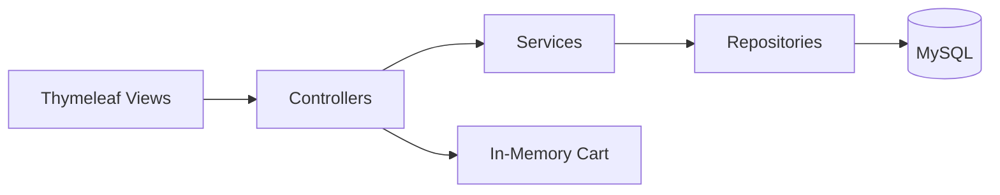

# Architecture Overview

## High-Level Flow

## Key Modules
- **Controllers**: Route requests, prepare models, handle auth
- **Services**: Business logic and data operations
- **Repositories**: JPA data access
- **Views**: Thymeleaf templates for UI

## Cart Design
- Stored in memory for fast iteration in internship scope
- Quantity controls manipulate cart items by product ID
- Totals are calculated in the controller for clarity

## Uploads
- Images saved to `uploads/productImages`
- Served via a custom resource handler
